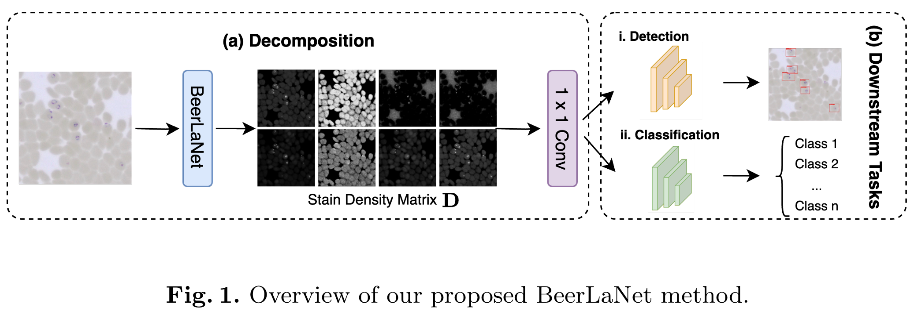

# [MICCAI 2025] BeerLaNet

## Adaptive Stain Normalization for Cross-Domain Medical Histology

[](https://link.springer.com/chapter/10.1007/978-3-032-04981-0_3)[](https://opensource.org/license/MIT)[](./docs/MICCAI2025-Poster.pdf)[](https://huggingface.co/spaces/yourname/BeerLaNet)[](
https://colab.research.google.com/github/<your-username>/<your-repo>/blob/main/notebooks/demo.ipynb)


This repository contains the official implementation of **BeerLaNet**, our MICCAI 2025 paper: 
[**Adaptive Stain Normalization for Cross-Domain Medical Histology**](https://link.springer.com/chapter/10.1007/978-3-032-04981-0_3)

### Highlights

- **Adaptive Stain separation**: Generalizes to arbitrary staining protocols without templates.  
- **Physics-Informed & Trainable**: Based on **Beer-Lambert law + algorithmic unrolling of NMF**.  
- **Plug-and-Play**: Can be integrated with any backbone (ResNet, YOLO, etc.) for downstream tasks.
- **Robust Across Domains**: Stable and competive performance on multiple histology datasets.



## Datasets

**1. Camelyon17-WILDS**

Tumor classification (domain adaptation benchmark datasets), containing 302k+ image patches (96×96) from lymph node WSIs across 5 hospitals.
**Labels**: Two categories. Tumor vs non-tumor
**Link**: https://wilds.stanford.edu/datasets

**2. Whole Blood Cell Detection Datasets**

- Blood Cell Count and Detection (BCCD) dataset, containing 366 blood smear images
**Labels**: Three categories. RBC, WBC and Platelets
  **Link**: https://github.com/Shenggan/BCCD_Dataset

- Blood Cell Detection Dataset (BCDD), containing 100 blood smear images
  **Link**: https://www.kaggle.com/datasets/draaslan/blood-cell-detection-dataset
  **Labels**: Three categories. RBC and WBC

**3. Malaria Blood Smear Dataset** 

Public Cell Detection dataset from [Guemas *et al.* (2024)](https://pubmed.ncbi.nlm.nih.gov/38171008/), containing 24,720 MGG-stained thin blood smear images with annotations.
**Labels**:  Four categories. White blood cells, red blood cells, platelets, and parasites
(including Trypanosoma brucei, and erythryocytes infected by P. falciparum, P.
ovale, P. vivax, P. malariase, and Babesia divergens).
**Link**: https://zenodo.org/records/8358829

**4. Malaria Lifestage Dataset**

Cell Classification dataset developed by Johns Hopkins University, containing *Plasmodium falciparum* single-cell images from multiple microscopy platforms (Nanozoomer, Zeiss, Olympus, Morphle).  
**Labels**: Five categories. Early ring, middle ring, late ring, trophozoite, schizont, gametocyte.
**Link**: 

----

## Installation

1. Clone Repository

   ```
   git clone https://github.com/xutianyue/BeerLaNet.git
   cd BeerLaNet
   ```

2. Install Dependencies

   ```
   conda create --name BeerLaNet pytorch==1.12.1 torchvision==0.13.1 torchaudio==0.12.1 cudatoolkit=11.3 -c pytorch
   pip install -r requirements.txt
   ```

## Implementation

### Demo

### Train with custom datasets

## Cite

If you find our work useful to your research, please cite it as:

```
@inproceedings{BeerLaNet,
  title={Adaptive Stain Normalization for Cross-Domain Medical Histology},
  author={Xu, Tianyue and Wu, Yanlin and Tripathi, Abhai K and Ippolito, Matthew M and Haeffele, Benjamin D},
  booktitle={International Conference on Medical Image Computing and Computer-Assisted Intervention},
  pages={24--33},
  year={2025},
  organization={Springer}
}
```
